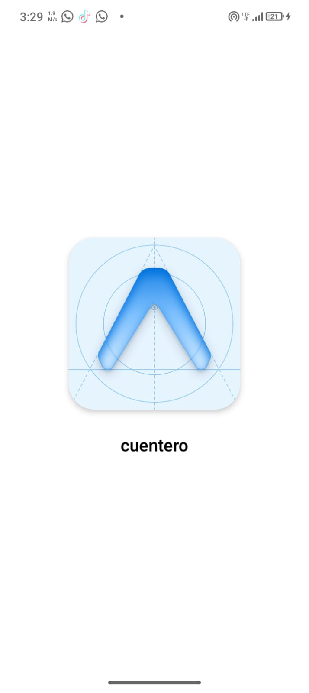
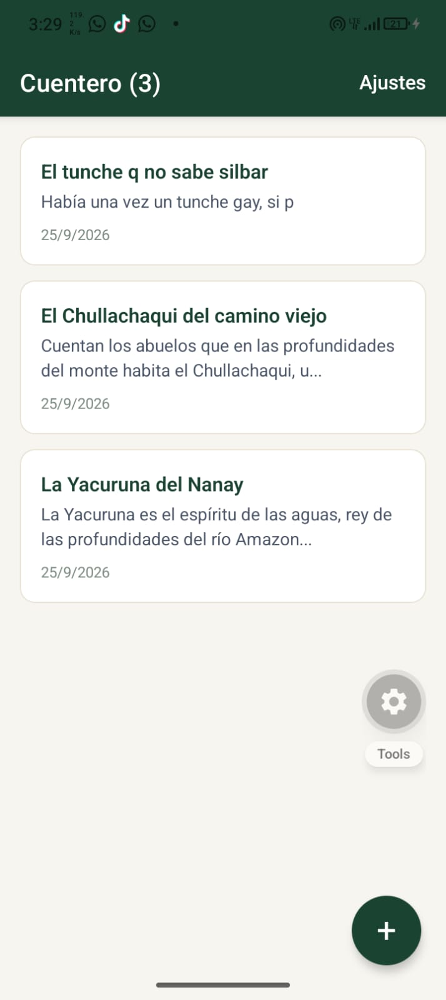
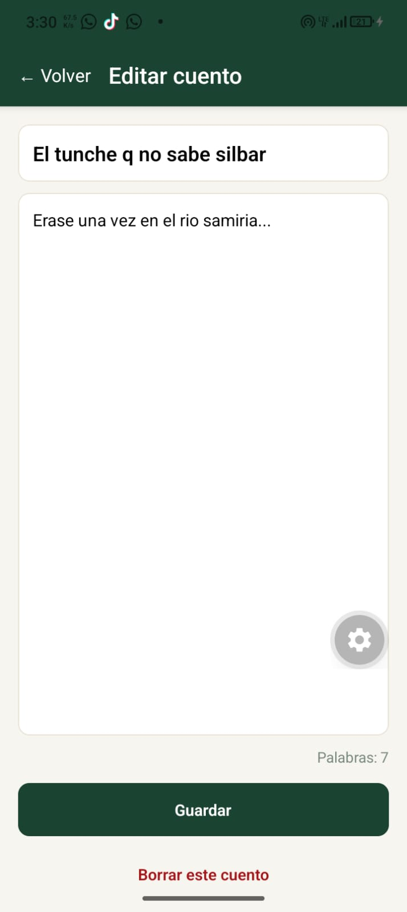
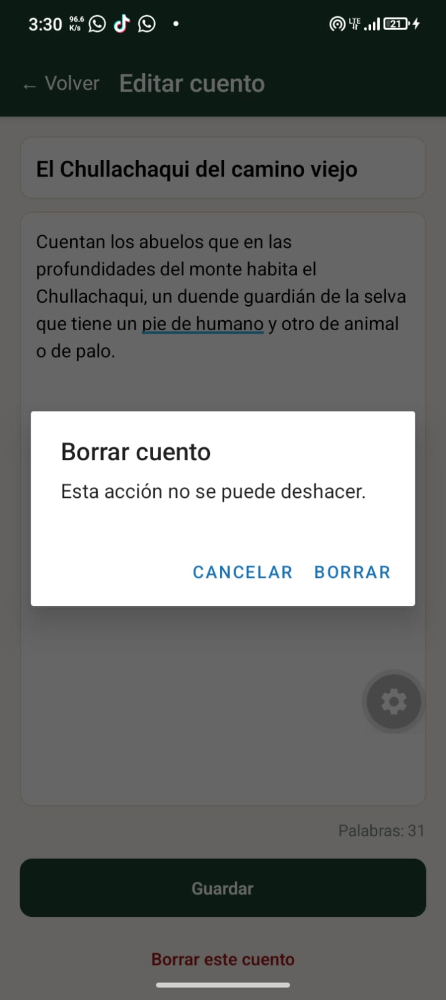

# Cuentero — App de Cuentos de la Selva

Aplicación móvil desarrollada con **React Native**, **Expo Router** y **SQLite** para la gestión y exportación de historias tradicionales de la selva.

## Estudiante
* **Nombre:** Maycol
* **Proyecto:** Cuentero

---

## Flujo y Pantallas de la Aplicación

| 1. Pantalla de Entrada | 2. Pantalla Principal | 3. Editar Cuento |
| :---: | :---: | :---: |
|  |  |  |
| Pantalla de carga (Splash Screen) al iniciar la app. | Lista de cuentos con contador total en cabecera y vista previa. | Editor de título y cuerpo con contador de palabras en tiempo real. |

<br/>

| 4. Eliminar Cuento | 5. Exportar Cuentos |
| :---: | :---: |
|  |  |
| Cuadro de diálogo de confirmación nativo antes de borrar un registro. | Módulo de Ajustes para exportar todos los datos a un archivo `.md`. |

---

## Tareas Implementadas
- [x] **Persistencia Local:** Base de datos SQLite integrada con `expo-sqlite`.
- [x] **CRUD Completo:** Crear, leer, actualizar y eliminar cuentos.
- [x] **T1. Contador de cuentos:** Muestra la cantidad total en la cabecera `Cuentero (3)`.
- [x] **T2. Contador de palabras:** Muestra la cantidad de palabras ingresadas en el editor (`Palabras: 7`).
- [x] **T3. Vista previa:** Muestra las primeras líneas del cuerpo en cada tarjeta de la lista.
- [x] **T5. Cuentos locales:** Historias registradas en la base de datos local.
- [x] **Exportación:** Generación y envío del respaldo `.md` mediante `expo-file-system/legacy` y `expo-sharing`.

---

## Ejecución del proyecto

1. **Clonar repositorio:**
   ```bash
   git clone [https://github.com/Maycol-Lozano/cuentero-lozano.git](https://github.com/Maycol-Lozano/cuentero-lozano.git)
   cd cuentero